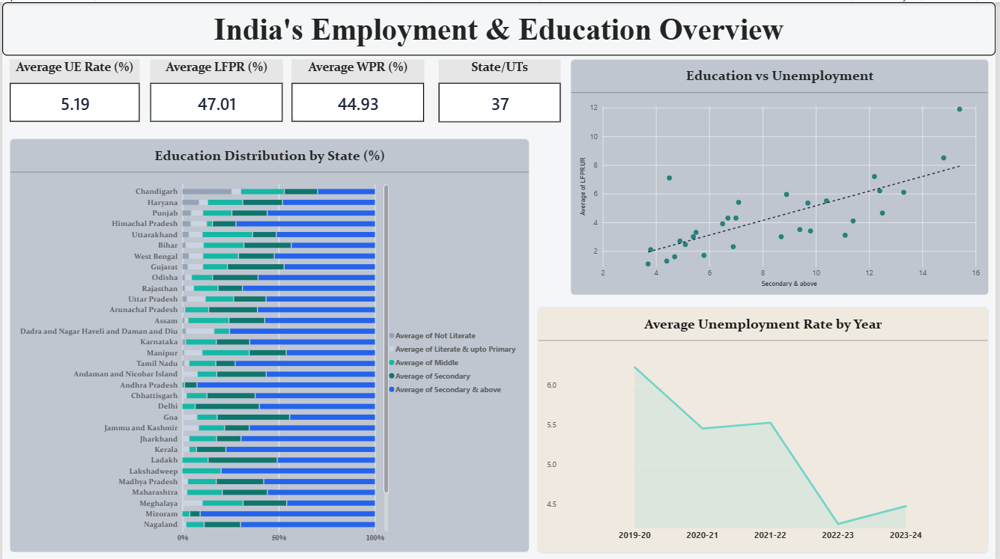

# India-employment-education-gap
Power BI analysis of employment, unemployment and education patterns across India (2019–20 to 2023–24)

## 📊 Project Overview
This project uses Government of India / PLFS data from **2019–20 to 2023–24** to examine how employment and education patterns vary across India.

The dashboard focuses on:
- State-wise unemployment rates
- Education levels and unemployment
- Labour Force Participation Rate (LFPR)
- Worker Population Ratio (WPR)
- Year-wise unemployment trends
- Regional differences across states and UTs

## 🛠️ Tools Used
- Power BI
- Power Query
- DAX
- Data Visualization
- EDA

## 📈 Dashboard

### 1. India’s Employment & Education Overview

### 2. Education & Employment Relationships

### 3. Employment Trends & Regional Insights

## 🔎 Key Findings
- Average unemployment declined from approximately **6.23% in 2019–20 to 4.48% in 2023–24**.
- Unemployment varies considerably across states and UTs.
- Higher levels of secondary-and-above education do not uniformly correspond to lower unemployment.
- LFPR and WPR show comparatively limited year-to-year movement in the dataset.

## 📚 Data Source
Government of India — Periodic Labour Force Survey (PLFS)
**Period:** 2019–20 to 2023–24

## 📁 Repository Contents
- `.pbix` — Power BI dashboard
- `screenshots/` — Dashboard screenshots
- `README.md` — Project documentation

## 👩‍💻 Author
**Navneet Kaur**
